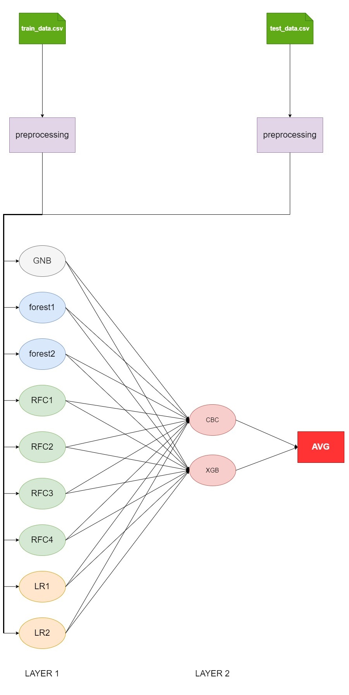

# American Express - Default Prediction

Решение представляет собой двухуровневый стекинг из 11 моделей (девять моделей на первом слое, две на втором). Схематично решение представленно на рисунке ниже:



Модели первого уровня:

```
gnb = GaussianNB()

forest1 = СustomForest(criterion='gini', 
                       cat_features=cat_features, 
                       verbose=True, 
                       random_state=13)

forest2 = СustomForest(criterion='entropy', 
                       cat_features=cat_features, 
                       verbose=True, 
                       random_state=21)

rfc1 = RandomForestClassifier(n_estimators = 50, 
                              criterion='entropy', 
                              max_features='sqrt', 
                              min_samples_leaf=2, 
                              verbose=5, 
                              random_state=34,
                              n_jobs=-1)
rfc2 = RandomForestClassifier(n_estimators = 100, 
                              criterion='gini', 
                              max_features='log2', 
                              min_samples_leaf=4, 
                              verbose=5, 
                              random_state=55,
                              n_jobs=-1)
rfc3 = RandomForestClassifier(n_estimators = 150, 
                              criterion='entropy', 
                              max_features='sqrt', 
                              min_samples_leaf=8,
                              verbose=5, 
                              random_state=89,
                              n_jobs=-1)

rfc4 = RandomForestClassifier(n_estimators = 400, 
                              criterion='gini', 
                              max_features='log2', 
                              min_samples_leaf=16,
                              verbose=5, 
                              random_state=144,
                              n_jobs=-1)

lr1 = LogisticRegression(solver='sag', 
                         penalty='l2', 
                         C=7, 
                         random_state=233, 
                         n_jobs=-1)

lr2 = LogisticRegression(solver='sag', 
                         penalty='l2', 
                         C=1, 
                         random_state=377, 
                         n_jobs=-1)
```

Модели второго уровня:

```
cbc = CatBoostClassifier(
                         learning_rate = 0.05, 
                         n_estimators = 2000,
                         max_depth = 5, 
                         random_state=42, 
                         max_leaves = 50,
                         grow_policy = 'Lossguide',
                         task_type="GPU",
                         verbose = 250
)

xgb = XGBClassifier(objective='binary:logistic', 
                    n_estimators = 1000, 
                    random_state=23, 
                    learning_rate = 0.3, 
                    max_depth=6, 
                    tree_method='gpu_hist', 
                    verbosity = 3)

```

Обработка данных включает в себя следующие этапы:
- удаление признаков, где пропусков больше чем 20%;
- заполнение пропущеных значений;
- кодирование категориальных признаков методом one-hot-encoding;
- группировка признаков по идентификатору клиента следующими статистиками: среднее значение ```np.mean()```, 
стандартное отклонение ```np.std()```, минимальное значение ```np.min()```, максимальное значение ```np.max()```, 
первое значение ```df.first()```, последнее значение ```df.last()```.